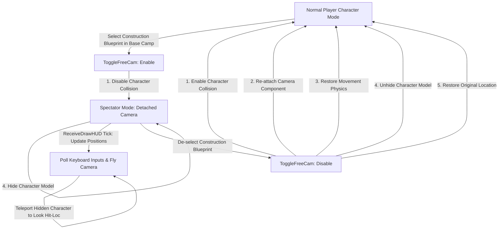

# Free Camera (Native Spectator) Mod Architecture

This directory contains the FreeCam mod, which detaches the camera component from the player character during construction to allow flight and collision-free building within Base Camp boundaries.

## File Structure

- `Info.json`: Mod metadata (author, version, and dependencies).
- `enabled.txt`: Installation and enablement instructions.
- `debugDeploy.bat`: Developer utility script to synchronize files with local game directory.
- `Scripts/main.lua`: entrypoint. Registers hotkeys and system hooks.
- `Scripts/FreeCam/helpers.lua`: Decoupled utility routines for fetching engine libraries, checking base camp bounds, and tracing aiming distance/location.
- `Scripts/FreeCam/camera.lua`: Encapsulated camera state (spectating flag, cached properties, speeds, position coordinates) and state transitions.

## Architecture Guidelines

### Strict File Size Limits
All scripts in this directory must remain under **300 lines of code** to preserve context budget and readability.
- `main.lua`: Minimal hook setups and key bindings.
- `helpers.lua`: Decoupled engine-querying logic.
- `camera.lua`: State modifications and movement calculations.

### Lifecycle of the FreeCam Spectator

## UE4SS Hook Points

1. `/Game/Pal/Blueprint/UI/BP_PalHUD_InGame.BP_PalHUD_InGame_C:ReceiveDrawHUD`
   - Triggered every render frame. Used to poll key controls and update camera/hidden character positions synchronously.
2. `/Script/Pal.PalBuilderComponent:IsInstallAtReticle`
   - Hooked to force return `true` while spectating, allowing construction objects to be placed dynamically at the reticle instead of locking onto the player character.
