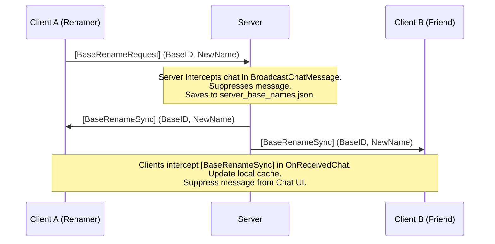

# Future Feature Plan: Multi-Player Synchronized Base Renaming

This document details the architectural design and implementation details for a Palworld Lua mod (`BaseRenamer`) that allows players to rename their base camps individually and syncs the custom names across all players in a multiplayer session.

---

## Architecture & Synchronization Protocol

Because UE4SS Lua scripts cannot declare new native network packets or custom network RPCs at runtime, the mod leverages the built-in **Chat Message System** as a reliable, zero-dependency network transport layer. It operates invisibly by suppressing sync commands before they are displayed.



### 1. Rename Request (Client -> Server)
* When a player renames a base camp in the UI, the client mod constructs a special chat message:
  ```
  [BaseRenameRequest]:<base_id_string>:<custom_name>
  ```
  It sends this message using the player state's native chat function:
  `APalPlayerState:EnterChat(Msg, EPalChatCategory.Global)`

### 2. Server-Side Interception & Persistency
* The server-side mod hooks `APalGameStateInGame:BroadcastChatMessage` (which runs before any chat message is broadcast to other clients).
* If the message matches the `[BaseRenameRequest]:` pattern:
  1. It parses the base camp ID and the desired name.
  2. It saves the mapping to a server config file: `server_base_names.json`.
  3. It constructs a synchronization message: `[BaseRenameSync]:<base_id_string>:<custom_name>`.
  4. It calls `BroadcastChatMessage` with the new sync message.
  5. It blocks the original request message from being broadcast to anyone's chat logs (returns `true` or bypasses).

### 3. Sync Broadcast & Suppression (Clients)
* All clients running the mod hook `UPalUIChat:OnReceivedChat`.
* If a message matches `[BaseRenameSync]:`:
  1. The client mod extracts the ID and custom name.
  2. It stores it in the client's local memory cache and saves it to `base_names.json` locally.
  3. It suppresses the message from rendering in the chat UI so the player never sees the command.
* If a player does not have the mod, the server's suppression prevents the raw request from showing up, so vanilla clients are unaffected and never see command clutter.

### 4. New Connection Sync (Late Joiners)
* When a client loads into the game, it sends a `[BaseRenameQuery]` chat command.
* The server intercepts this query and private-messages all active name mappings to that specific player using `UPalUtility:SendSystemToPlayerChat`. This ensures that players who join late get the full list of custom names immediately.

---

## UI Integration

### 1. Renaming Trigger (World Map)
* **Hover Capture:** The mod hooks `UWBP_MapPoint_Info_C:SetCampInfo(CanTeleport, BaseCampId)`. When a base camp icon is hovered on the map, this function is called, allowing us to cache the hovered base camp's `FGuid` ID in a global variable `HoveredBaseCampId`.
* **Hotkey Listener:** When the World Map widget is active and `T` is pressed:
  - If `HoveredBaseCampId` is valid, it constructs a transient `UBP_CharaCreNameEditWindowDispatchParameter_C` containing the current base camp name as the default text.
  - It pushes the native name-editing widget `UWBP_CharaCre_PlayerNameEdit_C` to the HUD overlay using `APalHUDInGame:CreateHUDWidget` or `Push`.
  - It hooks the name edit's confirm click to trigger the server rename request.

### 2. Display Overrides
To show the custom names in the UI, we hook two main functions:
* **Base Camp Model Getter:** We hook `/Script/Pal.PalBaseCampModel:GetBaseCampName`. If a custom name exists in the cache for the model's `ID`, we return the custom name. This automatically renames the base camp in the Palbox menu, HUD task checkers, and other native systems.
* **Map Tooltip Override:** The World Map tooltip widget (`UWBP_MapPoint_Info_C`) displays a static "Base" label by default. We post-hook `UWBP_MapPoint_Info_C:SetCampInfo` to locate the title text block `BP_PalRichTextBlock_C_139` and replace the static "Base" text with our custom base name.
